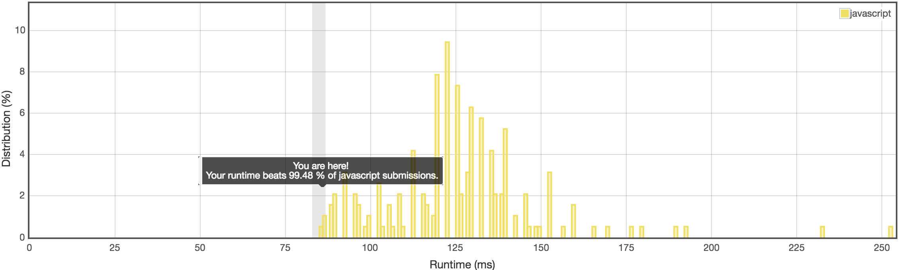

昨晚闲来无事，上leetcode点个pick one看了看，发现题目挺有意思的，就想做一下。

### 102.Binary Tree Level Order Traversal

Given a binary tree, return the level order traversal of its nodes' values. (ie, from left to right, level by level).

For example:
Given binary tree [3,9,20,null,null,15,7],
```
    3
   / \
  9  20
    /  \
   15   7
```
return its level order traversal as:
```
[
  [3],
  [9,20],
  [15,7]
]
```

```javascript
/**
 * Definition for a binary tree node.
 * function TreeNode(val) {
 *     this.val = val;
 *     this.left = this.right = null;
 * }
 */
/**
 * @param {TreeNode} root
 * @return {number[][]}
 */
var levelOrder = function(root) {

};
```

这篇文章就简单的写一下我的思考过程吧。

### 0.合适的数据结构搭配合适的算法

一开始我只看了问题的描述，没看代码区，我当时的理解：输入一个一维数组，将其转换为二叉树，返回一个二维数组，其中每个数组一维数组都存放该层节点的值。

能不能直接将这个一维数组转换成二维数组呢，如果是这样，岂不是只用一个O(n)就能解决这个问题？
于是，这道题似乎就成了一道纯粹的数学问题：找到数组下标与树的高度之间的关系。
一个节点的高度与其父节点有关，而具体的数学关系是怎样的呢？观察输入的数组，下标0为根节点，下标2为根节点的右子节点，下标6为右叶节点，父节点与子节点的下标之间会有2倍的关系，不难推出，如果右子节点的下标为i则父节点的下标为2*(i+1)。

在创建好二维数组之后，我纠结过到底是用深度优先搜索好还是广度优先搜索好。
考虑到只是关注父子节点之间的关系，所以还是用深度优先搜索。
真正在实现的时候，只是记得好像需要递归调用，连需要用到栈都忘了。但是到了最后代码写完发现，**只要用到了这个思想，具体怎么实现还是要根据需要来，不需要用到的就不用，不能把自己的思维固定死。**
```javascript
var levelOrder = function(root) {
  let number = [];
  const n = root.length + 1;
  for (let counter = 1, i = 0; counter < n; counter *= 2) {
    number[i++] = [];
  }

  dfs(root, number, n , 0);

  return number;
};

function dfs(root, number, n, i) {
  let nextRight = 2 * (i + 1),
    duplicateI = i,
    counter = 1;

  if (duplicateI === 0) {
    number[0].push(root[0]);
  } else {

    while ((duplicateI - 1) / 2 > 1) {
      duplicateI = (duplicateI - 1) / 2;
      counter++;
    }
    if (root[i]) {
      number[counter].push(root[i]);
    }

  }

  if (nextRight < n) {
    dfs(root, number, n, nextRight - 1);
    dfs(root, number, n, nextRight);
  }
}

console.log(levelOrder([3,9,20,null,null,15,7]));
```

其实我对这个算法不太满意，每次为了找到节点的高度，都需要做O(ln n)的运算，更加理想的算法应该只需要O(1)的运算。

### 1.审题很关键！！！

将写好的代码扔到上面去测试，结果显示错误。
> Run Code Status: Runtime Error

> Line 58: SyntaxError: Unexpected token )

这时候如何确定自己出的错误成了当务之急。我log了半天都没发现问题，直到我看清了原本问题给出的代码：
```javascript
/**
 * Definition for a binary tree node.
 * function TreeNode(val) {
 *     this.val = val;
 *     this.left = this.right = null;
 * }
 */
/**
 * @param {TreeNode} root
 * @return {number[][]}
 */
var levelOrder = function(root) {

};
```
函数给的参数是一个TreeNode，这是一个预先定义好的数据结构，它有三个属性：val表示节点储存的数据，left和right分别指向左右节点。
这下子问题就出大了，连题目都没读清楚就匆匆做题了😂。
因为输入的数据结构不一样，之前做的所有工作就要前功尽弃了，只能重新想办法。

既然传入的参数不是数组，就不是找数量关系的简单问题了。
回到起点，如何才能在遍历整棵树的同时记录下节点的高度？
我想了想，节点是一个对象，如果还是用递归的方法去遍历的话，应该需要记录下当前的节点，这样会使代码逻辑显得很乱，所以我打算用其他思路来解决这个问题。

之前传入数组的时候有考虑过用深度优先搜索还是广度优先搜索，最后是用深度优先搜索解决，现在可以尝试用广度优先搜索实现。代码实现如下：

```javascript
var levelOrder = function(root) {
  let number = [],
    queue = [];
  root.height = 0;
  queue.push(root);

  while (queue.length > 0) {
    let curr = queue.shift();

    if (!Array.isArray(number[curr.height])) {
      number[curr.height] = [];
    }
    number[curr.height].push(curr.val);

    if (curr.left) {
      curr.left.height = curr.height + 1;
      queue.push(curr.left);
    }
    if (curr.right) {
      curr.right.height = curr.height + 1;
      queue.push(curr.right);
    }

  }

  return number;
};
```
刚开始写好的时候测试都不能通过，返回值只是一个空的一维数组。这下子就尴尬了，难道之前在for循环定义二维数组的时候没定义出来？我debug了半天都觉得不是我for循环出的问题，难道我写了一个假的js？我不禁开始怀疑人生。。。

后来，我想到了一个idea，在插入数据之前先判断二维数组是否存在，如果不存在就创建数组，于是就写出了如上代码。
测试通过了，直接提交吧，结果却不尽如人意：
> Runtime Error Message:
Line 5: TypeError: Cannot set property 'height' of null

> Last executed input:
[]

测试的时候明明都成功了，为什么不通过？！我当时还没意识到如果传入空数组的情况，我当时在想：不会是因为这个对象是固定死的，不能添加额外的属性吧？**(其实js中所有的对象都可以改变属性，然而我忘了)**

#### 2.千锤百炼，精益求精

如果不更改已定义的TreeNode，又要记录节点的高度，我考虑过额外再构造一棵高度树，使高度树与定义的树一一对应。
后来转念一想，为了不更改之前已定义的数据结构，而去再定义一个自己的数据结构，这不是很浪费吗？
我灵光一闪，想到：如果不保存任何数据，直接在访问的时候就把高度记录下来岂不是很爽？
趁着idea还记着，赶紧把代码写下来：
```javascript
var levelOrder = function(root) {
  let number = [];

  dfs(number, root, 0);

  return number;
};

function dfs(number, curr, height) {
  if (curr) {
    if (!Array.isArray(number[height])) {
      number[height] = [];
    }
    number[height].push(curr.val);

    if (curr.left) {
      dfs(number, curr.left, height + 1);
    }
    if (curr.right) {
      dfs(number, curr.right, height + 1);
    }
  }
}
```
这其实是第一次代码的变体，将之前O(ln n)的求高度改成了O(1)的直接传入。
写完之后第一眼看过去，代码简介清晰，看上去特别舒服。

刚开始测试成功，提交不通过。我仔细看了看错误信息，发现是忽略了null的情况😂，加上一个判断，结果终于通过。

看了看排名，打败了99.48%的代码！！！
第一次提交成功就排到这么前，真的吓到了自己。
但是再想想，做这道题我思考了很多种方案，不断在优化当前的代码，最后才能拿到这样的名次。
这个过程让我想起了高中时期数学老师说过的话**解题，思考的越多，写的越少；反之，思考的越少，写的就越多。**
